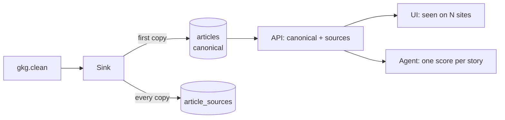

# dedup-syndication — Spec (Milestone 2a: one story, many sources)

Status: init approved · 2026-10-05

## 0. Review guide

**In three lines:** ~14 % of GKG rows are the same wire story republished on other sites (same title, different URL) **[verified]**. The sink will store **one canonical article per story** (story key = normalized title within a time window) and link every republication as a *source*; API, UI and the demo agent then see each story once, with a "seen on N sites" count.



**Review order:** §3 reality → §4 scope → §6 ACs → risks.

### Decisions

| ID | Decision | Status |
|---|---|---|
| D-1 | Where to dedup | Decided: write-side canonical in the sink, republications stored as linked sources (user choice over the read-side-grouping recommendation, 2026-10-05) |
| D-2 | Story match key | Decided: normalized title — lowercase, collapsed whitespace, trailing `| Site` / `- Site` suffix stripped (2026-10-05) |
| D-3 | Agent behavior | Decided: one score per story; follows automatically since the agent only ever sees canonicals (2026-10-05) |
| D-4 | Existing rows | Decided: no backfill/regrouping of pre-existing articles; the 7-day retention makes the store converge on its own (2026-10-05) |
| D-5 | False-merge guard | Decided: same story key only groups within a published_at window (default 48 h, configurable); exact value may be tuned in design **[assumption]** (2026-10-05) |

No open decisions.

### Open risks
1. **False merges**: two different stories can share a normalized title ("Hard Times", "Movie Review"). Mitigated by the window guard (D-5) and by keeping every merged copy retrievable as a source; still irreversible for the canonical row (the cost of D-1, accepted).
2. **Write-side is hard to undo**: unlike read-side grouping, merged copies never become full articles again. Accepted by the user 2026-10-05.
3. Canonical choice is "first copy wins": the canonical may be a syndicate, not the originating outlet. Canonical-quality selection → backlog.
4. M1 semantics: URL-level dedup (mvp AC-3/AC-6) still holds per URL; feed counts drop by ~14 % by design.

### Prerequisites you own
- None new; the M1 stack and labelled set stay as they are.

## 1. Problem

The GDELT feed lists every republication of a wire story as its own record. After M1, the store, feed, agent and metrics therefore see one story up to ~10×: the UI feed is cluttered, the agent wastes ~14 % of its LLM calls re-scoring the same headline, and story counts are inflated.

## 2. Goals and measures

| Goal | Measure |
|---|---|
| G1 One story, one row | AC-1…AC-5: canonical + sources in the store on real data |
| G2 Consumers see stories, not copies | AC-6…AC-8, AC-10: API/UI/cursor return canonicals with source counts |
| G3 Agent efficiency | AC-9: exactly one analysis per story; LLM calls drop ≈ the duplicate rate |
| L1 Learning | Entity-resolution-lite: normalization keys, canonical/alias modelling, write-path migration on a live system |

## 3. Data / reality (measured 2026-10-05 on two live slots)

- Slot `20261004081500`: 527 rows → 453 unique titles, 32 duplicate groups (30 cross-domain), **14 % redundant rows**. Slot `20261005131500`: 1208 rows → 1043 unique, 70 groups (all cross-domain), **14 %**. **[verified]**
- Largest groups 8–10 copies (PA/wire stories on Newsquest-style local sites). **[verified]**
- Title variants include a trailing `| <Site Name>` suffix on some copies — exact-match would miss these (seen in `docs/specs/mvp/labels.csv`). **[verified]**
- Copies of one story arrive both within one slot and across nearby slots (Ofgem story spread across the sampled window). **[verified]** Cross-slot spread beyond ~a day: unmeasured. **[assumption]** behind D-5's default window.
- The labelling exporter already dedups by title (fixed 2026-10-05); this feature moves grouping into the platform itself.

## 4. Scope of Milestone 2a (walking skeleton)

`gkg.clean → sink: story key → canonical article + article_sources → API (canonical + sources) → UI badge + sources list → agent scores canonicals only`

**In**
- `story_key` normalization in `newsdock_core` (D-2) with the window guard (D-5).
- Sink: first copy of a story becomes the canonical `articles` row; every copy (incl. the first) becomes an `article_sources` row; same-URL re-ingest stays idempotent.
- Alembic migration adding `article_sources` and the story key column; no backfill (D-4).
- API: canonicals only in search/list/feed; `source_count` in summaries; `sources[]` in the detail; cursor semantics unchanged for late copies.
- UI: "seen on N sites" badge in the feed; source list in the detail view.
- Retention: deleting a canonical cascades its sources.

**Out (→ backlog)**
Fuzzy/semantic matching (M3 embeddings), canonical-quality selection (prefer originating outlet), regroup/backfill job, cross-language grouping, merging analyses when stories merge late.

## 5. Users and key flows

- **Viewer:** sees each story once with a source count; can expand the sources.
- **Agent developer:** `list_new_articles` yields one item per story; `submit_analysis` attaches to the canonical.
- **Platform owner:** watches the sink log a dedup ratio per batch.

Flows: (1) sink groups copies as they arrive; (2) late copy of a known story only adds a source row; (3) UI browse with counts.

## 6. Acceptance criteria

```
AC-1  Story key normalization
  Given titles differing only in case, surrounding/duplicate whitespace,
        or a trailing "| Site Name" / "- Site Name" suffix
  When  story keys are computed
  Then  all variants yield the same key, and a visibly different title yields a different key
  Verify: auto

AC-2  Canonical plus sources
  Given an empty store and two gkg.clean copies of one story (same normalized
        title, different URLs, published 1 h apart)
  When  the sink processes both
  Then  articles holds exactly one row for the story and article_sources holds
        two rows (one per URL) linked to it
  Verify: auto

AC-3  Cross-slot copy
  Given a stored story
  When  a copy with a new URL arrives in a later slot (within the window)
  Then  no new articles row is created and one article_sources row is added
  Verify: auto

AC-4  Same-URL idempotency is preserved
  Given a stored story with its sources
  When  an already-stored URL is processed again
  Then  neither articles nor article_sources gains a row
  Verify: auto

AC-5  Window guard against false merges
  Given two articles with the same normalized title whose published_at differ
        by more than the configured window
  When  both are processed
  Then  the store holds two separate canonical articles
  Verify: auto

AC-6  Detail exposes sources
  Given a story with 3 sources
  When  get_article / GET /api/articles/{id} is called for the canonical
  Then  the response lists all 3 sources (url, domain) and source_count = 3
  Verify: auto

AC-7  Feed and search return stories once
  Given a story with multiple sources and other distinct articles
  When  search_articles / GET /api/articles runs
  Then  the story appears exactly once, with its source_count
  Verify: auto

AC-8  Late copies do not re-emit a story
  Given a cursor past a story
  When  a new copy of that story arrives and list_new_articles is called with the cursor
  Then  the story is not returned again
  Verify: auto

AC-9  One analysis per story
  Given a story with 3 copies in the agent's window
  When  the demo agent runs
  Then  exactly one analysis exists, attached to the canonical
  Verify: auto

AC-10 UI shows the grouping
  Given stored stories with and without multiple sources
  When  the user opens the feed and a grouped story's detail
  Then  the feed shows a "seen on N sites" badge where N > 1 and the detail lists the sources
  Verify: manual

AC-11 Retention cascades sources
  Given a canonical older than the retention window with sources
  When  the retention job runs
  Then  the canonical and all its source rows are gone
  Verify: auto

AC-12 Live dedup ratio is observable
  Given one real ingested slot
  When  the sink finishes it
  Then  the log reports copies grouped vs canonicals created for the batch
  Verify: auto
```

**Provisional targets — measure first (not ACs):** stored-article reduction ≈ 14 % on live slots; agent LLM calls drop by the same share; false-merge rate ≈ 0 on a hand-checked sample of grouped stories.

## 7. Non-functional (this milestone)

- Grouping must not break at-least-once semantics: redelivered messages stay idempotent at both URL and story level.
- The migration is forward-only and leaves existing rows untouched (D-4); mixed old/new rows must not crash reads.
- Story-key computation lives in `newsdock_core` (pure, testable); the window guard value is config, read only in `config.py`.

## 8. Assumptions

- The 48 h window default (D-5) is safe for wire syndication spread. **[assumption — measure in verify]**
- Normalized-title collisions between genuinely different stories within the window are rare enough for an MVP guard. **[assumption — spot-check in verify]**
- Sink remains the single writer, so story grouping needs no cross-process coordination. **[verified: M1 design]**

## Appendix: Glossary

- **Story**: one piece of journalism, possibly republished by many outlets.
- **Copy / republication**: one URL carrying a story (what GDELT records).
- **Canonical article**: the single `articles` row representing a story (first copy wins).
- **Source**: an `article_sources` row — one URL/domain that carried the story.
- **Story key**: normalized title (+ window guard) used to group copies.
- **Syndication**: wire-service distribution of one story to many outlets.
- **False merge**: two different stories wrongly sharing a story key.
- **Window guard**: maximum published_at spread for copies to group (D-5).
