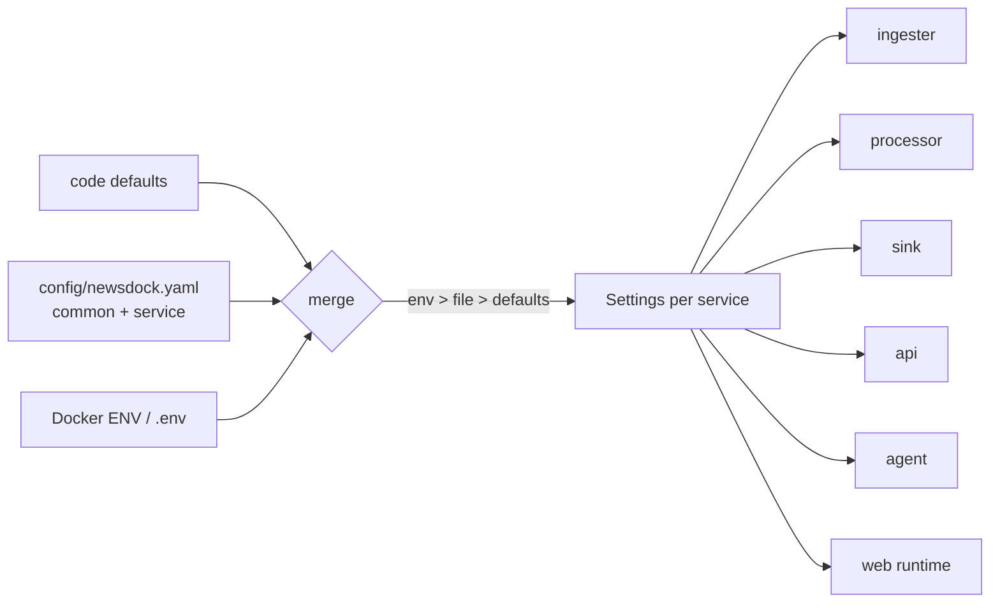

# externalize-config — Spec (one config file, env overrides, no hardcoded tunables)

Status: init approved · 2026-10-06 (D-8 confirmed at /spec-design)

## 0. Review guide

**In three lines:** Every tunable in the Python services and the web app moves into one hierarchical YAML file (`config/newsdock.yaml`: a `common:` parent that each service section inherits from and may override). Docker env vars override any key in the file, and code defaults apply when neither is set. Secrets stay in env only, and the compose wiring that depends on config values (healthcheck windows, ports, the repeated DB URL) is derived from it.



**Review order:** §3 inventory (what is hardcoded today) → §4 scope → §6 ACs → risks.

### Decisions

| ID | Decision | Status |
|---|---|---|
| D-1 | File format and layout | Decided: one shared YAML, `common:` parent plus one child section per service; a child inherits every `common` key and may override it (2026-10-06) |
| D-2 | Precedence | Decided: env > file > code defaults (2026-10-06) |
| D-3 | Scope | Decided: everything runtime in Python and the web app, including Kafka topic names (2026-10-06) |
| D-4 | Secrets | Decided: env / `.env` only; the loader rejects credential keys in the file (2026-10-06) |
| D-5 | Infra reach | Decided: app behaviour plus compose wiring derived from it (healthcheck windows, DB URL composition). Image tags and Kafka broker internals stay in compose (2026-10-06). Amended in design 2026-10-06: host-published ports stay in `.env` (compose cannot read the YAML) and container-internal ports are fixed by compose, so `api.port` applies to non-container runs |
| D-6 | Web settings | Decided: runtime config read when the web server starts, so one image works anywhere; replaces build-time `NEXT_PUBLIC_API_BASE` (2026-10-06) |
| D-7 | Domain-tuning constants | Decided: stay in code (story-key thresholds, agent prompt and output schema, GKG column count, dead-letter reason names) (2026-10-06) |
| D-8 | Topic names no longer "fixed" | Decided: topic names move from CLAUDE.md "Fixed names" to config, with the defaults `gkg.raw`, `gkg.clean`, `gkg.dlq` unchanged; implied by D-3 and recorded here as the required approval (2026-10-06) |

No open decisions.

### Open risks
1. **Collides with M2a (`dedup-syndication`)**: it is mid-implement and has uncommitted edits to `sink/config.py`, `sink/domain/writer.py` and `sink/adapters/kafka.py`, the files this feature rewrites. Finish and commit M2a first, or design around its branch.
2. **Agent isolation (mvp AC-13)**: a shared file puts Kafka and DB-adjacent values in a file the agent container could read. Mitigation in AC-12; the design must decide between mounting the whole file and mounting a per-service slice.
3. **Silent drift**: healthcheck windows and ports are coupled to config values today (§3, items marked C). If compose is not derived from the file, changing an interval can mark a healthy service unhealthy.
4. **Doc drift**: topic names appear in ~6 code places and many docs; D-8 requires CLAUDE.md "Fixed names", design docs and ADRs that repeat them to be updated in the same change.
5. **Web runtime config** is the least conventional part for Next.js (build-time inlining is the default); the design must pick the mechanism.

### Prerequisites you own
- Approve D-8 explicitly when you skim this (it edits a "do not rename" rule in CLAUDE.md).
- Decide when M2a is committed, since this work builds on it.

## 1. Problem

Config is half-externalised. Every app already has an env-driven `config.py` (pydantic-settings), but: there is no file source at all; compose sets only `DATABASE_URL`, `KAFKA_BOOTSTRAP_SERVERS` and the agent's two URLs, so every other tunable silently sits at its code default; and many values are literals with no env path (topic names in six places, retry counts, retention days, timeouts, page sizes, healthcheck windows). Changing any of them means editing code and rebuilding.

## 2. Goals and measures

| Goal | Measure |
|---|---|
| G1 One place to configure | AC-1, AC-2, AC-4: one YAML with `common` + service sections drives all services |
| G2 Docker-friendly overrides | AC-3, AC-5: env beats file beats defaults; the file path is itself settable |
| G3 No hardcoded tunables left | AC-8…AC-11: every §3 item marked HARD is configurable, and a check keeps it that way |
| G4 Safe by construction | AC-6, AC-7, AC-12: unknown keys rejected, no secrets in the file, agent stays isolated |
| G5 Compose and web follow config | AC-13, AC-14 |
| L1 Learning | Layered configuration (12-factor), typed settings with inheritance, runtime config in a Next.js standalone image |

## 3. Data / reality (scan of the working tree, 2026-10-06)

Today **[verified]** (read this session): six `config.py` files (ingester, processor, sink, api, agent, `newsdock_db`) use pydantic-settings with env prefixes `NEWSDOCK_` (agent: `NEWSDOCK_AGENT_`, `extra="forbid"`; db: unprefixed `DATABASE_URL`). pydantic-settings 2.15.0 ships `YamlConfigSettingsSource` and PyYAML 6.0.3 is installed, so a YAML source needs no new library **[verified]**. No app reads a file today.

Legend: **cfg** = already env-configurable; **HARD** = literal in code; **HARD\*** = parameter default that `__main__` never passes; **C** = compose value coupled to a config value.

| Area | Hardcoded today | Status |
|---|---|---|
| Kafka topics | `gkg.raw`, `gkg.clean`, `gkg.dlq` in ingester, processor (2 files), sink and `infra/kafka/create-topics.sh` (6 copies); partitions/replication in the script | HARD |
| Kafka clients | group ids `processor`, `sink`; `auto.offset.reset=earliest`; `enable.auto.commit=False` | HARD\* / HARD |
| Ingester | GDELT fetch timeout 60 s; index path `/lastupdate.txt`; `MAX_ATTEMPTS=4`; poll floor 900 s | HARD / HARD\* |
| Sink | `RETENTION_DAYS=7`; `DEFAULT_WINDOW` 48 h duplicate of `story_window_hours` | HARD |
| API | `FIRST_RUN_WINDOW` 1 h; payload cap 64 KB; page sizes 20/100 (search) and 50/200 (list-new); Kafka probe timeout 1 s; uvicorn options; CORS methods/headers | HARD |
| Agent | `batch_limit=200`; Ollama timeout 120 s; temperature 0; `/api/chat` path; eval threshold 0.5; export `--limit` 100 and 30 s timeout | HARD\* / HARD |
| Web | `POLL_MS=60_000`; `NEXT_PUBLIC_API_BASE` inlined at build time (the Dockerfile and compose never set it, so the image always bakes the default); list page size not sent | HARD |
| `newsdock_db` | engine has only `pool_pre_ping=True`; no pool size, overflow or recycle | HARD |
| Compose (C) | healthcheck windows `-mmin -20` (ingester) and `-mmin -2` (processor, sink, agent) tied to poll/loop intervals; api healthcheck hardcodes `localhost:8000`, web `localhost:3000`; published ports; `postgresql+psycopg://…@postgres:5432/…` repeated 4× | HARD |
| Already cfg but never set by compose | every `NEWSDOCK_*` var (poll interval, batch sizes, story window, agent model, theme prefixes …) | cfg, unused |

Unchanged by design (D-7): story-key thresholds (`MIN_REMAINDER`, `MAX_SEGMENT`, `MAX_STRIP_ITERATIONS`), agent prompt and `OUTPUT_SCHEMA`, `GKG_COLUMN_COUNT=27`, dead-letter reason names, `MAX_DLQ_LINE_CHARS`, status literals such as `pending` / `published`.

Design deviation (needs your OK, see design.md): `enable.auto.commit=False` and `follow_redirects=True` stay in code. They are architecture/GDELT invariants (CLAUDE.md: manual offset commits; follow redirects), not tunables, so a config value could only break correctness.

Findings the design must handle: poll floor 900 s is a GDELT rule (CLAUDE.md) and must stay enforced whatever the file says; `NEWSDOCK_AGENT_*` extra-forbid behaviour (mvp TC-35) must keep working.

## 4. Scope (walking skeleton)

Thinnest slice that proves the chain end to end: the loader + `common`/service inheritance + env override + one real value per layer flowing through compose into a running service, then the rest of the inventory by repetition.

**In**
- Shared loader in a package (`packages/` home decided in design) giving each app a settings class with sources in order: init args → env → YAML file → defaults.
- `config/newsdock.yaml` (committed, no secrets) with `common:` and `ingester`, `processor`, `sink`, `api`, `agent`, `web` sections; `NEWSDOCK_CONFIG_FILE` selects the path.
- Moving every HARD / HARD\* item in §3 (Python, web, `newsdock_db` pool, topic names) behind settings with the current values as defaults.
- Compose: mount the file read-only, pass `.env`, derive healthcheck windows from config (the worker writes its own allowed heartbeat age), remove the 4× repeated DB URL with a compose extension anchor; host ports stay in `.env`.
- Web runtime config (D-6).
- A check (in `make check`) that fails when a listed literal reappears outside `config.py` / defaults.
- Doc updates: CLAUDE.md fixed names, specs/designs/ADRs that repeat topic names, `.env.example`, README config section.

**Out**
- Secrets in the file, a secret manager, hot reload, per-environment overlays, JSON-schema publication (see backlog).
- Kafka broker settings, image tags, Dockerfile base images (D-5).
- Domain-tuning constants and data-format facts (D-7).
- Any change to pipeline behaviour: with no file and no env, every service must behave exactly as today.

## 5. Users and key flows

User: the sole maintainer running the stack locally (and later deploying it).
1. **Tune by file:** edit `config/newsdock.yaml` (e.g. `ingester.poll_interval_seconds`), `make up`, the service uses it.
2. **Override by env:** set `NEWSDOCK_POLL_INTERVAL_SECONDS` in `.env` or the compose environment; it wins over the file.
3. **Share a value:** set `common.log_level` once; every service inherits it, one service overrides it.
4. **Change an endpoint without rebuilding:** set the API base for the web container at start; no image rebuild.

## 6. Acceptance criteria

```
AC-1  File value is used
  Given a config file with ingester.poll_interval_seconds: 1800 and no matching env var
  When  the ingester settings are loaded
  Then  poll_interval_seconds is 1800
  Verify: auto

AC-2  Common parent is inherited and overridable
  Given a file with common.log_level: DEBUG and ingester.log_level: WARNING, and no log_level under sink
  When  the sink and ingester settings are loaded
  Then  sink log_level is DEBUG and ingester log_level is WARNING
  Verify: auto

AC-3  Env beats file
  Given a file with ingester.poll_interval_seconds: 1800 and env NEWSDOCK_POLL_INTERVAL_SECONDS=2400
  When  the ingester settings are loaded
  Then  poll_interval_seconds is 2400
  Verify: auto

AC-4  No file, same behaviour as today
  Given no config file exists and no env vars are set
  When  each service's settings are loaded
  Then  every value equals the pre-change default (a recorded snapshot of today's defaults)
  Verify: auto

AC-5  File path is configurable and fails fast
  Given env NEWSDOCK_CONFIG_FILE points to a path that does not exist
  When  a service starts
  Then  it exits non-zero with a message naming the missing path (an unset variable with no default file is not an error)
  Verify: auto

AC-6  Unknown keys are rejected
  Given a file containing a misspelled key, e.g. sink.batchsize
  When  the sink settings are loaded
  Then  loading fails with a message naming the section and the key
  Verify: auto

AC-7  Secrets are rejected in the file
  Given a file containing database_url or a password key in any section
  When  any service's settings are loaded
  Then  loading fails naming the key, and DATABASE_URL still loads from env
  Verify: auto

AC-8  Topic names come from one setting
  Given common.kafka.topics.clean: gkg.clean.test in the file
  When  the processor routes a valid row and the sink consumes
  Then  the processor produces to gkg.clean.test and the sink subscribes to gkg.clean.test (default topics unchanged otherwise)
  Verify: auto

AC-9  Ingester retry limit and timeouts are configurable
  Given ingester.max_attempts: 2 in the file
  When  a slot returns 404 on two consecutive cycles
  Then  the slot is marked failed after the second attempt, and a poll interval below 900 s is still raised to 900
  Verify: auto

AC-10  Retention is configurable
  Given sink.retention_days: 3
  When  the retention cutoff is computed at a fixed "now"
  Then  the cutoff is exactly 3 days before "now"
  Verify: auto

AC-11  No tunable literals remain
  Given the inventory of §3 as a check list
  When  make check runs the config-literal check on the source tree
  Then  it passes on the finished code and fails if a listed literal (topic names, retry count, retention days, timeouts, page sizes) is reintroduced outside config files
  Verify: auto

AC-12  Agent stays isolated
  Given a file with common.kafka and sink sections, and an agent section
  When  the agent settings are loaded, and separately when the agent section contains a kafka_* or database_* key
  Then  the first load succeeds and the agent settings expose no Kafka or database field; the second load fails naming the key
  Verify: auto

AC-13  Healthcheck follows config
  Given ingester.poll_interval_seconds: 1800 in the file and a heartbeat file last touched 25 minutes ago
  When  the ingester healthcheck command runs
  Then  it reports healthy (allowed age derived from the configured interval), and reports unhealthy at 45 minutes
  Verify: auto (unit; the compose scene of make test-infra covers the wiring)

AC-14  Web follows runtime config
  Given the web container started with the API base set only in env or the file, built from one unchanged image
  When  the page loads in a browser
  Then  the browser requests articles from that API base, with no image rebuild
  Verify: manual
```

Provisional targets (measure first, not requirements): none.

## 7. Non-functional requirements

- **Backwards compatible:** existing `.env`, `NEWSDOCK_*` and the unprefixed aliases (`KAFKA_BOOTSTRAP_SERVERS`, `MCP_URL`, `OLLAMA_URL`, `DATABASE_URL`) keep working.
- **Layering rules hold:** env and file are read only in `config.py` (DR-9; ruff `TID251` stays); `domain/` and `newsdock_core` import no file or env code.
- **Typed and validated:** fully typed settings, mypy strict, validators (poll floor 900 s) preserved.
- **Existing gates stay green:** `make check`, `make test-rules` (with a new rule test for AC-11), `make test-infra` scenes.
- **Observability of config:** each service logs its effective non-secret config at startup (secrets redacted). **[assumption]** useful, cheap, confirm in design.

## 8. Assumptions

- **[verified]** pydantic-settings 2.15.0 has a YAML source; PyYAML is installed (checked this session).
- **[assumption]** `config/` at the repo root is acceptable; CLAUDE.md DR rules allow only `apps/ packages/ infra/ docs/ .github/` at the root, so a top-level `config/` folder needs an ADR, or the file lives at `infra/config/newsdock.yaml` (design decides).
- **[assumption]** Inheritance is implemented in the loader (merge `common` under the service section), not with YAML anchors, so env overrides and error messages can name keys.
- **[assumption]** Compose can derive healthcheck windows by templating from the same file or by a small helper script; the mechanism is a design decision.
- **[memory]** Next.js standalone builds inline `NEXT_PUBLIC_*` at build time; a server-side runtime read is the usual workaround.
- **[assumption]** This is roadmap work between M2a and M2 (call it M2b); `/roadmap update` places it.

## Appendix: Glossary

- **Common (parent) section:** top-level `common:` key whose values every service section inherits.
- **Service section:** child key (`ingester`, `processor`, `sink`, `api`, `agent`, `web`) holding that service's overrides.
- **Effective config:** the final merged values after env > file > defaults.
- **HARD / HARD\* / cfg / C:** inventory labels, see §3.
- **12-factor config:** the practice of keeping deploy-varying settings in the environment, here combined with a file for non-secret defaults.
- **Heartbeat file:** the file a worker touches each loop; the Docker healthcheck checks its age.
- **Healthcheck window:** the `find -mmin` age limit in a healthcheck; must exceed the service's loop or poll interval.
- **DR-n:** directory rule n from the foundation spec §6.
- **M2a / M2b:** milestone labels in `docs/roadmap.md`.
- **LayeredSettings:** the shared pydantic-settings base class in `newsdock_config` that every service's `Settings` extends (env > file > defaults).
- **Heartbeat max age:** the allowed age of the heartbeat file, written by the worker into the file itself so the healthcheck needs no config value.
- **Topic job:** the one-shot compose service that creates the Kafka topics; Python after this milestone.
- **Spike:** a throwaway experiment that answers one question and is not committed.
