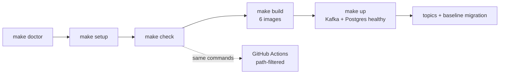

# foundation — Spec (Milestone 0: project setup)

Status: init approved · 2026-10-05 (updated 2026-10-05: directory rules DR-1…DR-13, AC-16, AC-17)

## 0. Review guide

**In three lines:** newsdock has approved docs but no runnable project. M0 sets up the monorepo so M1 can start with `/spec-plan mvp` on solid ground: toolchain installed and checked, six app skeletons with tests, one `make check`, a compose stack with Kafka and Postgres, CI, and docs. It contains no newsdock domain logic.



**Review order:** §3 reality → §4 scope → §6 acceptance criteria → risks below.

### Decisions

| ID | Decision | Status |
|---|---|---|
| D-1 | Container runtime | Decided: Docker Desktop (2026-10-05) |
| D-2 | M0 cut line | Decided: skeleton + all six app images build; services are not run yet (2026-10-05) |
| D-3 | Command runner | Decided: `make` (2026-10-05) |
| D-4 | Service boundaries | Decided: keep one deployable per responsibility: `ingester`, `processor`, `sink`, `api`, `agent` (Python) + `web`; merging into 2 backend services not chosen (2026-10-04, roadmap discussion). Recorded as an ADR in `/spec-design` |
| D-5 | Toolchain family | Decided: `uv` workspace for Python, `pnpm` for web (planned in `CLAUDE.md`, 2026-10-04); Python 3.12 and Node 24 LTS are provisioned by uv and pnpm, not required on PATH (2026-10-05) |
| D-6 | Layering inside Python apps | Decided: `domain/` + `adapters/` in every Python app (2026-10-05) |
| D-7 | Python package names | Decided: `newsdock_<app>` prefix, e.g. `newsdock_api`, `newsdock_core` (2026-10-05) |
| D-8 | Directory rule enforcement | Decided: automated in `make check` and CI (2026-10-05) |
| D-9 | Database access and migrations | Decided: SQLAlchemy 2 + Alembic, shared package `packages/db` (2026-10-05, ADR-0008) |

No open decisions. Tool choices inside those families (linter, type checker, Node pin, base images) are left to `/spec-design`, see §8; the migration tool is decided (D-9).

### Open risks
1. **Version drift.** Everything here moves fast (uv, pnpm, Next.js, ruff, Docker). Mitigation: lockfiles plus a recorded version table in the README.
2. **Node.** The installed Node is 26.9.0, a Current release, not LTS (§3). Decided: pnpm provisions Node 24 LTS from `devEngines.runtime` (ADR-0009); verified in the first task.
3. **Scope creep into M1.** Running services, healthchecks for workers and OpenAPI type generation are explicitly out (backlog).
4. **Old `make`.** macOS ships GNU Make 3.81; keep the Makefile simple.

### Prerequisites you own
- Install Docker Desktop (needs GUI and an admin password) and start it once.
- Install the Ollama app and pull any one small model (the M1 model choice happens in its spike).
- Commit or stash the pending doc edits in the working tree before M0 implementation starts (10 modified files at 2026-10-05).

## 1. Problem

The repo has specs, ADRs and a layout on paper, but no toolchain, no commands and no CI. Without a shared setup, M1 would mix setup work into feature tasks, and mistakes (wrong Python, missing Docker, services importing each other, Dockerfiles broken) would surface late.

## 2. Goals and measures

| Goal | Measure |
|---|---|
| G1 Reproducible setup | AC-1, AC-2, AC-15: a clean clone reaches green checks by following the README alone |
| G2 One command verifies everything | AC-3…AC-6 |
| G3 Architecture and directory rules enforced, not just written | AC-7, AC-16, AC-17 (rules DR-1…DR-13, §6) |
| G4 Infra runs locally | AC-8…AC-11 |
| G5 CI mirrors local commands | AC-12, AC-13 |
| G6 Docs are discoverable | AC-14, AC-15 |
| L1 Learning | uv workspaces, pnpm, multi-image Docker builds, Compose healthchecks, CI path filters, ADRs each appear as a concrete artefact |

## 3. Data / reality (checked 2026-10-05, this machine and registries)

**Machine.** macOS (Darwin 25.5), arm64, 48 GB RAM, 827 GB free **[verified]**. Missing: `docker`, `ollama`, `uv`, `pnpm`, `gh` **[verified]**. Present: Python 3.12.14 (Homebrew) and system Python 3.9.6, Node v26.9.0, npm 11.19.1, GNU Make 3.81, git 2.50.1, Homebrew 7.0.6 **[verified]**.

**Repo.** One commit on `main`; `origin` is `git@github.com:telephant/newsdock.git` **[verified]**, so CI is GitHub Actions **[assumption]**. `apps/*` and `infra/` hold only README stubs, `packages/core/` only a README; `.gitignore` already covers `.env`, `__pycache__`, `.venv` **[verified]**.

**Current versions** (Homebrew / registries) **[verified]**: uv 0.12.23, pnpm 12.9.1, Next.js 16.3.8 (needs Node ≥ 20.9), ruff 0.16.10, mypy 2.4.0, pytest 9.1.1, Ollama 0.35.1, Docker Desktop cask 4.93.0, Docker CLI 29.8.2, Compose 5.6.0, `just` 1.58.0 (not chosen).

**Node release lines** (nodejs.org index) **[verified]**: 24.21.0 "Krypton" and 22.23.3 "Jod" are LTS; 26.10.0 and 25.9.0 are Current. The installed 26.9.0 is therefore not LTS.

**Images M0 needs** **[verified, Docker Hub]**: `apache/kafka` 4.2.2 (non-rc) and `pgvector/pgvector` `pg16` tags exist.

**Not verified:** Docker Desktop 4.93 compatibility with this macOS version **[assumption]**; Docker Desktop licensing for personal use is free **[memory]**; GitHub Actions path-filter and runner behaviour **[memory]**; which pyright/mypy and import-boundary tool fits uv workspaces (design).

## 4. Scope of Milestone 0 (walking skeleton)

`doctor → setup → check (6 apps) → build (6 images) → up (Kafka + Postgres) → topics + baseline migration → CI runs the same`

**In**
- Toolchain installed by the owner, versions pinned and documented; a `doctor` command verifies it.
- `uv` workspace (`apps/{ingester,processor,sink,api,agent}`, `packages/core`, `packages/db`) and `apps/web` Next.js + TS scaffold, each with dependency file, Dockerfile, README and one smoke test.
- `make` targets: `doctor`, `setup`, `check` (lint, format, types, tests for all apps), `build`, `up`, `down`, `docs-check`.
- Directory and layering rules DR-1…DR-13 (§6), enforced by `make check`: an app may import `packages/*` but never another app; Python apps split into `domain/` and `adapters/`.
- `infra/`: compose with `kafka` (KRaft) and `postgres` (pgvector), healthchecks, idempotent topic setup (`gkg.raw`, `gkg.clean`, `gkg.dlq`), a baseline migration and its runner, `.env.example`.
- GitHub Actions: path-filtered check and image build.
- Docs: README (setup, commands, version table), per-app READMEs, docs index, service-boundary ADR (written in `/spec-design`), `CLAUDE.md` updated with real commands (replaces the T-00 note).

**Out (→ backlog)**
Any newsdock domain code (GKG parsing, tables beyond the baseline, MCP, UI pages), running the app services, worker heartbeats, OpenAPI type generation, pre-commit hooks, dependency bots, secret/image scanning, cloud deploy, observability, Linux/Windows setup.

## 5. Users and key flows

- **Platform owner (you):** installs tools, runs `make doctor`, `make setup`, `make check`, `make up`.
- **Future contributor / reviewer:** clones, follows the README only, reaches green checks.
- **CI:** runs the same `make` targets on pull requests.

Flows: (1) first-time setup; (2) daily loop: edit, `make check`; (3) infra loop: `make up`, `make down`; (4) PR: CI checks only what changed.

## 6. Directory rules and acceptance criteria

### Directory rules (apply to all future code)

| ID | Rule | Enforced by |
|---|---|---|
| DR-1 | Repo root holds only `apps/`, `packages/`, `infra/`, `docs/`, `.github/` and root tooling files (`Makefile`, `pyproject.toml`, `uv.lock`, `.python-version`, `.env.example`, `.gitignore`, `.dockerignore`, `README.md`, `CLAUDE.md`). No source code at the root | AC-16 |
| DR-2 | `apps/<name>` is one deployable per folder; the names are `ingester`, `processor`, `sink`, `api`, `agent`, `web`. A new app or new top-level folder needs an ADR | AC-16 |
| DR-3 | Required skeleton. Python app: `pyproject.toml`, `Dockerfile`, `README.md`, `src/newsdock_<app>/`, `tests/`. Web: `package.json`, `Dockerfile`, `README.md`, `src/` | AC-16 |
| DR-4 | Python code lives only in `src/newsdock_<app>/` (shared: `packages/<pkg>/src/newsdock_<pkg>/`) and tests only in `tests/`; no other Python files in an app. Outside apps, Python is allowed only in `infra/scripts/` and `infra/migrations/` | AC-16 |
| DR-5 | `__main__.py` is the only entrypoint: it wires config and starts the loop or server, with no business logic | review |
| DR-6 | In every Python app, `domain/` holds pure logic (imports only stdlib, pydantic and `newsdock_core`; never `newsdock_db`); `adapters/` holds all I/O (Kafka, Postgres, HTTP, filesystem, clock; for `api` also the HTTP/MCP handlers). `adapters` may import `domain`, never the reverse | AC-17 |
| DR-7 | Apps import `packages/*` only, never another app. `newsdock_core` never imports an app, `newsdock_db` or an I/O library (kafka, sqlalchemy, alembic, psycopg, httpx, fastapi) | AC-7, AC-17 |
| DR-8 | Shared contracts (topic message schemas, analysis score payload, MCP tool input/output models) are defined once in `newsdock_core.contracts`; apps import them, never redefine them | review |
| DR-9 | Configuration is read only in each app's `config.py` (env via pydantic-settings); `os.environ` is not read elsewhere; no secrets in code or images | AC-17 |
| DR-10 | Unit tests mirror `src/` under `tests/unit/`; tests needing Kafka or Postgres live in `tests/integration/` and are marked; real GDELT sample fixtures live only in `packages/core/tests/fixtures/` | review |
| DR-11 | `infra/` holds `compose.yaml`, `kafka/` (topic setup) and `migrations/` (Alembic project: `alembic.ini`, `env.py`, `versions/NNNN_<name>.py`, numbered, forward-only) and `scripts/` (doctor, layout and docs checks). SQL and query construction appear only in migrations and in `adapters/`, always parameterized | review |
| DR-12 | Web `src/`: `app/` holds thin routes only; `features/<name>/` holds feature code (components, hooks, queries for that feature); `components/` holds shared presentational UI with no data fetching; `lib/api/` is the generated API client, never hand-edited, never importing from Python code | review |
| DR-13 | Specs in `docs/specs/<name>/`, ADRs in `docs/adr/`; each app README has Purpose, Entrypoint, Dependencies, Run/Test; no other docs inside `apps/`, except the `AGENTS.md` and `CLAUDE.md` that Next.js generates in `apps/web` | AC-14 |

Rule changes need the user's approval and an ADR, like any decided item.

### Acceptance criteria

Target names (`doctor`, `setup`, `check`, `test`, `build`, `up`, `docs-check`) are fixed here; `/spec-design` may add more.

```
AC-1  Doctor detects a missing tool
  Given a machine where one required tool (Docker, Compose, uv, pnpm, Ollama) is not on PATH
  When  `make doctor` runs
  Then  it exits non-zero and the output names the missing tool and how to install it
  Verify: auto

AC-2  Doctor passes and reports versions
  Given a machine set up as the README says and Ollama running with at least one model pulled
  When  `make doctor` runs
  Then  it exits 0 and prints each tool version, the Python and Node versions that uv and pnpm resolve, and the Ollama model names
  Verify: manual

AC-3  One workspace, everything importable
  Given a fresh clone
  When  `make setup` runs
  Then  one Python environment exists in which all five apps and the shared packages (`newsdock_core`, `newsdock_db`) import without error, and web dependencies are installed from the lockfile
  Verify: auto

AC-4  Check is green on the skeletons
  Given a fresh clone after `make setup`
  When  `make check` runs
  Then  lint, format check, type check and tests run for all Python apps and for web, and the command exits 0
  Verify: auto

AC-5  Check fails on a defect
  Given a deliberate type error added to one app
  When  `make check` runs
  Then  it exits non-zero and the output names that app
  Verify: auto

AC-6  Every app has a passing smoke test
  Given each of the six apps
  When  its tests run alone (`make test APP=<name>`)
  Then  at least one test runs and passes
  Verify: auto

AC-7  Apps cannot import each other
  Given one app that imports another app
  When  `make check` runs
  Then  it exits non-zero with a boundary violation naming both apps; imports of `packages/*` stay allowed
  Verify: auto

AC-8  All images build
  Given Docker is running
  When  `make build` runs
  Then  an image for each of the six apps builds and the command exits 0
  Verify: auto

AC-9  Infra comes up healthy
  Given a `.env` copied from `.env.example` and Docker running
  When  `make up` completes
  Then  `kafka` and `postgres` both report healthy and the Postgres image has the `vector` extension available
  Verify: auto

AC-10 Topic setup is idempotent
  Given Kafka is healthy
  When  topic setup runs twice
  Then  topics `gkg.raw`, `gkg.clean` and `gkg.dlq` exist with one partition each and the second run exits 0 without changing them
  Verify: auto

AC-11 Baseline migration is idempotent
  Given Postgres is healthy
  When  migrations are applied twice
  Then  the `vector` extension exists, the baseline is recorded once, and the second run exits 0
  Verify: auto

AC-12 CI checks only what changed
  Given a pull request that changes only `apps/web`
  When  CI runs
  Then  the web check runs and the Python app checks are skipped
  Verify: manual

AC-13 CI builds the changed image
  Given a pull request that changes only `apps/api`
  When  CI runs
  Then  the `api` image builds and the other app images do not
  Verify: manual

AC-14 App docs are complete
  Given the six app folders
  When  `make docs-check` runs
  Then  each app README has Purpose, Entrypoint, Dependencies and Run/Test sections and every relative link in `README.md`, `docs/` and app READMEs resolves
  Verify: auto

AC-15 Clean-clone onboarding
  Given a clean clone and only `README.md`
  When  a person follows its setup steps in order
  Then  they reach a green `make check` and a healthy `make up` without reading any other document
  Verify: manual

AC-16 Layout rules are enforced
  Given a Python file outside `src/newsdock_<app>/` or `tests/`, or an app missing a required skeleton file, or an unlisted top-level folder
  When  `make check` runs
  Then  it exits non-zero and the output names the violated rule (DR-1…DR-4) and the path
  Verify: auto

AC-17 Layering and config rules are enforced
  Given `domain/` importing an I/O library or `adapters`, or `newsdock_core` importing an app or an I/O library, or `os.environ` read outside `config.py`
  When  `make check` runs
  Then  it exits non-zero and the output names the violated rule (DR-6, DR-7 or DR-9) and the file
  Verify: auto
```

**Provisional targets: measure first (not ACs)**
- `make check` duration on the skeletons; cold and warm `make build` duration.
- `make up` time to healthy; image sizes per app.
- CI wall time for a one-app change versus a full run.

## 7. Non-functional (M0 only)
- Python 3.12+, fully typed; Node pinned to an LTS line; versions pinned by lockfiles.
- No secrets committed; `.env` git-ignored; `.env.example` holds only placeholders.
- Commands are idempotent and safe to re-run; no command needs `sudo`.
- Supported platform: macOS arm64. **[assumption]**

## 8. Assumptions
- CI is GitHub Actions (origin is GitHub, §3). **[assumption]**
- Docker Desktop 4.93 runs on this macOS version. **[assumption]**
- Left to `/spec-design` (not decided here): linter/formatter (ruff expected), type checker (mypy or pyright), import-boundary tool, test layout, Node LTS pin and how to install it, Dockerfile base images and layering, Makefile structure, CI workflow layout, Compose service naming.
- Python and web test frameworks per DR-10 follow `/spec-design`; the rules only fix where tests live.
- Kafka image `apache/kafka` in KRaft mode, single broker, as in the M1 design. **[verified: tag exists; behaviour not run]**

## Appendix: Glossary
- **Monorepo**: one git repository holding several apps and shared packages.
- **uv / uv workspace**: Python package manager; a workspace is several packages sharing one lockfile and environment.
- **pnpm**: Node package manager used for `apps/web`.
- **Docker Desktop / Compose**: container runtime for macOS / tool that runs several containers from one file.
- **Ollama**: tool to run LLMs locally; M0 only checks it is installed and has a model.
- **Compose profile**: label that keeps some services out of a plain `docker compose up`; M0 uses profile `apps` for build-only app services.
- **Rule test**: a test that adds a deliberate violation and checks that `make check` fails naming the rule.
- **Healthcheck**: command Docker runs to decide whether a container is ready.
- **KRaft**: Kafka's built-in metadata mode replacing ZooKeeper.
- **pgvector**: Postgres extension for vector similarity search; installed, unused until M3.
- **Topic (Kafka)**: named message log.
- **Idempotent**: repeating an operation gives the same end state.
- **Migration**: versioned change applied to the database; the baseline (`0001`) is the first one.
- **SQLAlchemy / Alembic**: Python SQL toolkit / its migration tool; Alembic records the current revision in `alembic_version`.
- **Import boundary**: rule limiting which packages may import which.
- **Domain / adapters**: layering where `domain/` is pure logic and `adapters/` is all I/O; adapters depend on domain, never the reverse.
- **src layout**: Python code under `src/<package>/` so tests import the installed package, not loose files.
- **Smoke test**: minimal test proving a component starts and imports.
- **LTS / Current**: Node release lines; LTS gets long-term support, Current is the newest.
- **CI path filter**: running only the jobs whose files changed.
- **Preflight (`doctor`)**: command that checks the machine has the required tools.
- **ADR**: Architecture Decision Record, `docs/adr/NNNN-<decision>.md`.
- **Walking skeleton**: thinnest end-to-end slice touching every layer.
