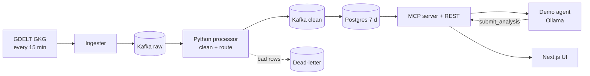

# mvp — Spec (Milestone 1: walking skeleton)

Status: init approved · 2026-10-04

## 0. Review guide

**In three lines:** newsdock ingests the GDELT GKG feed every 15 min, cleans and dedups it with a plain Python stream processor over Kafka, keeps 7 days in Postgres (+pgvector), and exposes it to custom AI agents through an MCP server and REST. The MVP proves the chain on live data with one demo financial-relevance agent (local Ollama) and a Next.js UI.



**Review order:** §3 real data → §4 scope → §6 acceptance criteria → risks below.

### Decisions

| ID | Decision | Status |
|---|---|---|
| D-1 | GDELT streams in the MVP | Decided: GKG only (2026-10-04) |
| D-2 | Agent integration | Decided: MCP server + REST (2026-10-04) |
| D-3 | 7-day store | Decided: PostgreSQL + pgvector (2026-10-04) |
| D-4 | Frontend | Decided: Next.js + TypeScript (2026-10-04) |
| D-5 | Stream processing engine | Decided: plain Python Kafka consumer/producer; Flink dropped to cut the learning curve (changed 2026-10-04, was PyFlink); Flink returns as backlog M4 |
| D-6 | Agent subscription model | Decided: pull via MCP with cursor; push is M2 (2026-10-04) |
| D-7 | Demo agent LLM | Decided: local model via Ollama (2026-10-04) |

No open decisions. The earlier `newsdock` spec folder was ignored by choice (fresh start); delete it yourself if it is obsolete.

### Open risks
1. **Kafka learning curve.** Topic/consumer-group/offset semantics are new; the processor and sink are plain Python to keep that the only new thing. Flink is deferred (backlog M4).
2. Small local Ollama models give noisy relevance scores; mitigated by structured output and a labelled eval set (AC-14).
3. GDELT quirks (§3): the newest listed file can 404; GKG has no article body.
4. Scope creep: push subscriptions, Events/Mentions and cloud deploy are out.

### Prerequisites you own
- Hand-label ≥ 50 articles (financial / not) for AC-14.
- Install Docker and Ollama with one small model on your machine.

## 1. Problem

News is high-volume and unstructured. Anyone building an AI agent over news (finance, risk, supply chain) first has to solve ingestion, cleaning, dedup, retention and access: the same undifferentiated work every time. newsdock is the shared "news dock": it handles the stream once and lets any custom agent plug in.

## 2. Goals and measures

| Goal | Measure |
|---|---|
| G1 Real-data pipeline works end-to-end | AC-1…AC-7, AC-15 pass against the live GDELT feed |
| G2 Agents integrate through a standard interface | AC-8…AC-11, AC-13; the demo agent has no DB access |
| G3 A human can inspect the data | AC-12 |
| G4 Valuable demo | Financial-relevance agent reports precision/recall on a labelled set (AC-14) |
| L1 Learning | Kafka (topics, consumer groups, offsets, dead-letter) + idempotency, MCP, LLM agent + eval, Python async services, docker-compose each appear as a concrete component |
| L2 Portfolio | Public repo with README, architecture diagram, one-command start, demo video; checked at handoff, not an AC |

## 3. Data / reality (checked 2026-10-04 against the live feed)

**Feed index.** `https://data.gdeltproject.org/gdeltv2/lastupdate.txt` lists 3 files for the latest 15-minute slot: `*.export.CSV.zip` (Events), `*.mentions.CSV.zip`, `*.gkg.csv.zip` (GKG). Line format: `size md5 url`. **[verified]**
- `http://` redirects (301) to `https://`; clients must follow redirects. **[verified]**
- `masterfilelist.txt` lists history back to 2015-02-18. **[memory]** (the URL answers, content not read this session)
- **Quirk, reproduced twice:** the newest slot's GKG file (`20261004074500`, later `20261004081500`) returned **404 with 0 bytes** right after being listed; the Events file for `…081500` did too, while Mentions returned 200. The ingester must treat 404/empty as "retry later", not as failure or data. **[verified]**
- Slots are every 15 minutes, UTC timestamp in the file name → 96/day, 672 per 7 days. **[assumption]** (arithmetic from cadence)

**Observed sizes (one sample, not a statistical claim).** GKG `20261004071500`: 1.4 MB zipped, 342 rows, 27 columns, 4.3 MB unzipped. **[verified]** Extrapolation ≈ 30–35k rows/day, ≈ 230k per 7 days, ≈ 2.9 GB raw if all text is kept. **[assumption]** Volume is moderate: Kafka is justified by learning and decoupling, not throughput. Say so honestly in the README.

**GKG record (tab-separated, no header, 27 columns).** Column count and content **[verified]** by sampling; column names **[memory]** from the GDELT 2.0 codebook.
- Identity/time: `GKGRECORDID`, `DATE`.
- Source: collection id, `SourceCommonName` (domain), `DocumentIdentifier` (**article URL**).
- Enrichment: V1/V2 counts, themes (taxonomy codes such as `WB_*`, `ECON_*`), locations (lat/long), persons, organizations, V2 tone (7 numbers: tone, positive, negative, polarity, activity, self-reference, word count), GCAM dictionary scores, quotations, names, amounts, translation info.
- Extras column (XML-ish): `<PAGE_TITLE>`, `<PAGE_LINKS>`, `<PAGE_ALTURL_AMP>`, publish timestamp. All sampled rows had a `PAGE_TITLE` tag but at least one was empty. **[verified]**
- **No article body text.** The MVP works from title, URL, themes, entities, tone. Fetching bodies means scraping third-party sites (legal/robustness) → backlog.
- Main feed is English-processed; a separate `translation.gkg` feed covers other languages. **[memory, not checked]** → out of scope.

**Events/Mentions** exist (CAMEO coded events). Events files can contain old events re-reported (2 of 663 rows had a 2016 `SQLDATE`). **[verified]** Out of scope per D-1.

**Re-check 2026-10-04 08:42 UTC (design stage).** Slot `20261004081500`: 200, 2.26 MB, 527 rows, all 27 columns, 0 empty URLs, 0 missing/empty `PAGE_TITLE`, 0 duplicate URLs within the slot **[verified]**. Slots `…083000` and `…084500` were listed in `masterfilelist.txt`/`lastupdate.txt` but returned 404 (0 bytes); the 27-min-old slot was available, so lag is roughly 12–27 min **[verified]**. Empty themes are common: 86/527 rows have empty V1/V2 themes, 109 empty persons, 150 empty orgs **[verified]**; tone is always present. Column positions match the codebook (5 URL, 9 V2 themes, 13 V2 persons, 15 V2 orgs, 16 tone, 27 extras). Cross-slot duplicate rate not measured yet **[assumption]**.

**Not verified:** GDELT redistribution/attribution terms (**[memory]**: open, citation requested). Check before any public hosted demo.

## 4. Scope of Milestone 1 (walking skeleton)

`GDELT GKG file → ingester → Kafka raw → Python processor (clean) → Kafka clean → Postgres (7 d) → MCP server + REST → demo agent (Ollama) → analysis written back → web UI`

**In**
- GKG-only poller, 15-min cadence, idempotent per slot.
- Kafka topics: raw, clean, dead-letter.
- Python processor: parse 27 columns, keep a curated subset, drop rows missing URL/title; dedup by URL happens at the Postgres write.
- Postgres store with 7-day retention (pgvector installed, not used yet).
- MCP server (read tools + write-back tool) and REST API for the UI.
- Demo financial-relevance agent as a separate process using only MCP.
- Minimal UI: article feed with filters, detail view, agent score.
- docker-compose one-command start; README with architecture diagram.

**Out (→ backlog)**
Events/Mentions, translation feed, push/webhook/SSE subscriptions, auth and agent registry, article body scraping, embeddings/semantic search, windowed analytics, cloud deploy, observability stack, history backfill.

## 5. Users and key flows

- **Platform owner (you):** `docker compose up`, watches data flow, opens the UI.
- **Agent developer (you, later others):** connects an MCP client, calls `search_articles` / `list_new_articles`, then `submit_analysis`.
- **Viewer (portfolio reviewer):** opens README/UI, sees live news and agent scores with reasons.

Flows: (1) ingest cycle every 15 min; (2) agent run: list new articles since cursor → score → write back; (3) human browses and filters in the UI.

## 6. Acceptance criteria

```
AC-1  Ingest a slot
  Given a published GKG slot file
  When  the ingester processes that slot
  Then  one raw Kafka message per row is published
  Verify: auto

AC-2  Unpublished slot is retried
  Given the GKG URL returns 404 or an empty body
  When  the ingester polls
  Then  nothing is published, the event is logged, and the next cycle retries without a crash
  Verify: auto

AC-3  Re-ingest is idempotent
  Given a slot already ingested and stored
  When  the same slot is ingested again
  Then  the store holds the same article count (no duplicates)
  Verify: auto

AC-4  Bad rows go to dead-letter
  Given a raw row with no URL or no title
  When  the processor handles it
  Then  it is not stored and a dead-letter message with a reason exists
  Verify: auto

AC-5  Field extraction
  Given a fixture of ~20 real GKG rows
  When  they pass through the pipeline
  Then  each stored article has title, URL, domain, published time, themes, persons, organizations and tone matching the expected values
  Verify: auto

AC-6  Cross-slot dedup
  Given two rows with the same URL in different slots
  When  both are processed
  Then  the store contains one article for that URL
  Verify: auto

AC-7  7-day retention
  Given articles aged 6 days and 8 days
  When  the retention job runs
  Then  the 8-day article is gone and the 6-day article remains
  Verify: auto

AC-8  MCP tool list
  Given the running MCP server
  When  a client lists tools
  Then  it sees search_articles, get_article, list_new_articles and submit_analysis
  Verify: auto

AC-9  Search filters
  Given stored articles with varied time, theme, domain and title
  When  search_articles is called with time range, theme, domain and title text
  Then  only matching articles are returned, at most the requested limit
  Verify: auto

AC-10 Cursor semantics
  Given a cursor returned by list_new_articles
  When  it is called again with that cursor before any new slot
  Then  it returns no articles and the same-or-newer cursor
  Verify: auto

AC-11 Write-back
  Given a stored article
  When  submit_analysis(article_id, agent_name, payload) is called
  Then  get_article returns that analysis
  Verify: auto

AC-12 UI feed
  Given stored articles, some with agent scores
  When  the user opens the UI feed and filters by theme
  Then  matching articles show newest first with the agent score where present
  Verify: manual

AC-13 Agent isolation
  Given the demo agent's container environment
  When  it runs
  Then  it holds no database or Kafka credentials, has no network route to Postgres or Kafka, and reaches data only through the API service
  Verify: auto

AC-14 Agent evaluation
  Given a labelled set of ≥ 50 articles
  When  the single eval command runs the demo agent
  Then  it prints precision and recall
  Verify: auto

AC-15 End-to-end on live data
  Given a clean clone with `docker compose up`
  When  one real poll cycle on the live feed completes
  Then  all services report healthy and the UI lists at least one real article
  Verify: manual
```

**Provisional targets: measure first (not ACs)**
- End-to-end latency from slot publication to article visible: guess < 2 min.
- Demo agent F1 on the labelled set: guess ≥ 0.7 with a small local model.
- Throughput headroom ≥ 10× the observed rate.
- Whole compose stack ≤ 8 GB RAM.

## 7. Non-functional (MVP only)
- Backend Python 3.12+, typed, tests run in CI. **[assumption]**
- At-least-once consumers with idempotent writes (needed for AC-3).
- Secrets via `.env`; none committed.
- Respect GDELT: poll the 15-min index only, interval configurable, never faster than 15 min.

## 8. Assumptions
- Hosting for the MVP is local docker-compose; cloud is a later milestone. **[assumption]**
- Apache Kafka in KRaft mode (no ZooKeeper). **[assumption]**
- GDELT stays free and key-less. **[assumption]**
- A small Ollama model runs on your machine; model choice happens in design. **[assumption]**
- English titles dominate the main GKG feed. **[assumption]**
- A public repo plus demo video delivers the portfolio value; no hosted demo yet.

## Appendix: Glossary
- **GDELT**: Global Database of Events, Language and Tone; open, 15-minute-updated worldwide news metadata.
- **GKG**: Global Knowledge Graph; one row per article with themes, entities, tone.
- **Slot**: a 15-minute publication window, `YYYYMMDDHHMMSS` in file names.
- **CAMEO**: coding scheme for events in the Events file.
- **Kafka topic / consumer / offset**: named message log / reader / reader position.
- **KRaft**: Kafka's built-in metadata mode replacing ZooKeeper.
- **Dead-letter topic**: topic for messages that could not be processed.
- **Idempotent**: repeating an operation gives the same end state.
- **MCP**: Model Context Protocol; standard way for LLM agents to discover and call tools.
- **Ollama**: tool to run LLMs locally.
- **pgvector**: Postgres extension for vector similarity search.
- **Walking skeleton**: thinnest end-to-end slice touching every layer.
- **Retention**: automatic deletion of data older than 7 days.
- **Cursor**: opaque marker meaning "everything up to here was read".
